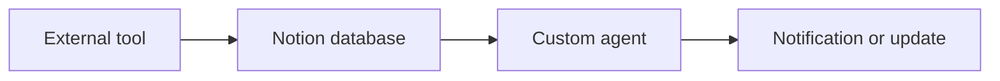

## Overview

Notion unifies notes, documents, projects, and AI agents in one workspace. You interact with built-in intelligence that automates routine work, surfaces answers instantly, and keeps projects moving without switching tools.

## Notion AI Writing and Summarization

Notion AI helps you draft, rewrite, and summarize content directly inside pages. Meeting Notes captures discussions automatically and turns them into action items and summaries.

<Tabs>
  <Tab title="Meeting Notes" icon="calendar">
    Record a call inside Notion. AI generates a structured summary with attendees, decisions, and follow-ups.

  </Tab>
  <Tab title="Writing Assistant" icon="edit">
    Highlight any text block and ask AI to tighten, expand, or change tone while staying inside your current page.

  </Tab>
</Tabs>

## Enterprise Search Across Workspaces

Enterprise Search finds information across every page, database, and connected app you have access to.

<Callout kind="info">
  Search respects permissions, so you only see results you are allowed to read.
</Callout>

## Project and Task Management

Use databases to track tasks, milestones, and owners. Views switch between boards, calendars, and timelines without extra setup.

<Columns cols={2}>
  <Card title="Projects" icon="briefcase" href="#">
    Group tasks by initiative and link related docs in one place.
  </Card>
  <Card title="Tasks" icon="check-circle" href="#">
    Assign owners, set due dates, and receive updates inside the same workspace.
  </Card>
</Columns>

## Custom Agents and Connections

Create agents that watch specific pages or databases and perform actions when conditions are met. Connect external tools to bring data into Notion automatically.

## Examples

<Expandable title="Sample agent workflow" default-open="false">
  An agent monitors a project database. When a task status changes to "Blocked", it posts a summary in the team channel and creates a follow-up page.

</Expandable>

## Best Practices

- Keep one source of truth by linking related pages instead of duplicating content.
- Use clear database properties so AI and search return accurate results.
- Review agent permissions regularly to maintain workspace security.