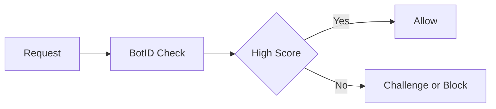

## Overview

Vercel protects every deployment with layered security controls that activate automatically. You gain protection against common web threats without extra configuration or third-party services. The platform combines network-level defenses, application-layer rules, and identity verification to keep your sites and APIs safe.

<Callout kind="info">
  Security settings apply at the project level. Changes take effect on the next deployment.
</Callout>

## DDoS Protection

Vercel absorbs and filters distributed denial-of-service attacks at the edge. Traffic passes through a global network that detects and blocks malicious patterns before they reach your application.

<Card title="Automatic Mitigation" icon="shield" href="#">
  No manual rules required. Vercel scales capacity during attacks and restores normal routing once traffic normalizes.
</Card>

## Web Application Firewall

The built-in Web Application Firewall inspects incoming requests for common exploits such as SQL injection and cross-site scripting. You control rule sets through the dashboard or configuration files.

<Tabs>
  <Tab title="Dashboard" icon="monitor">
    Enable or disable rule categories with a single toggle. Review blocked requests in real time.
  </Tab>
  <Tab title="Configuration" icon="code">
    Define custom rules in your project settings.
  </Tab>
</Tabs>

## BotID Verification

BotID distinguishes legitimate users from automated scripts. You receive a score for each request and can block or challenge suspicious traffic.



## Compliance Controls

Vercel maintains certifications that help you meet regulatory requirements. You can export audit logs and configure data residency options from the same interface.

<Expandable title="Supported Standards" default-open="false">
  Review current certifications and request compliance documentation through the dashboard.
</Expandable>

## Configuration Examples

<CodeGroup tabs="vercel.json,CLI">
```json
{
  "security": {
    "waf": { "enabled": true },
    "botid": { "enabled": true }
  }
}
```
```bash
vercel security enable --waf --botid
```
</CodeGroup>

## Best Practices

Follow these recommendations to strengthen your security posture.

- Review blocked request logs weekly.
- Start with default WAF rules and tighten them only after testing.
- Combine BotID scores with rate limiting for high-value endpoints.
- Enable audit logging before production launches.