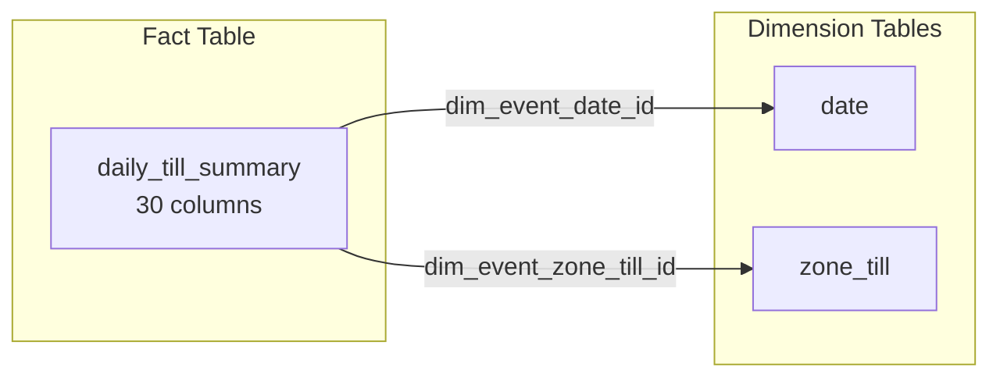

**ERD Test with Mermaid (clickable links)**

<Iframe src="https://blob-cdn.documentation.ai/org-852a81c4-9351-4db1-9f23-cefe8e32d308/doc-031af356-8855-43ab-950b-8f736a72c767/1782220534839-nim1fb5kfp-coupons-erd.svg" width={800} height={1050} 
  sandbox="allow-scripts allow-same-origin allow-popups" 
  title="Daily Till Summary ERD" />

