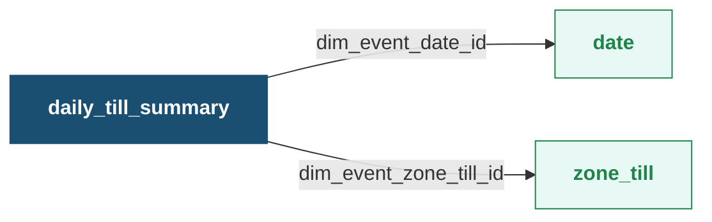

This facts table captures the daily transactions conducted at a specific point of sale (POS) terminal (till). It captures the information such as sales, points redeemed, returns, and loyalty activities, allowing businesses to analyze POS-specific performance.

**Databricks Table Name:** daily_till_summary

**Daily Till Summary - Entity Relationship Diagram (ERD)**

Zoom in the table for more clarity. Click the table title to view its details.

**Daily Till Summary Fact Table**

| Column Name | Data Type | Description | Linked Table |
| --- | --- | --- | --- |
| dim_event_date_id | bigint | Date of the transaction. It is the primary key of the table. | [date](https://docs.capillarytech.com/docs/dimension-tables#date) |
| dim_event_zone_till_id | bigint | Identifier assigned to the point-of-sale (POS) terminal within a store. It distinguishes one checkout location from another within the same store. It is the primary key of the table. | [zone_till](https://docs.capillarytech.com/docs/dimension-tables#zone-till) |
| not_interested_bill_count | bigint | Number of bills generated from purchases of not-interested customers. | _ |
| points_redeemed | double | Total points redeemed by the transactions made through the till (Point of sale counter). | _ |
| total_bills | bigint | Total number of bills generated through the till. | _ |
| member_returns | bigint | Total count of returns from members. | _ |
| points_returned | double | Total points reverted because of return transactions. | _ |
| total_sales | double | Total sales generated at the till including taxes and discounts. | _ |
| non_loyalty_sales | double | Sales generated from non-loyalty customers. | _ |
| non_member_returns | bigint | Count of returns made by non-members. | _ |
| extra_sales | double | The total sales amount generated from bills where points were redeemed at the till. | _ |
| number_of_non_loyalty_bills | bigint | Number of bills generated for non-loyalty customers. | _ |
| non_loyalty_sales_from_lineitem | double | Total sales from all the line items purchased by non-loyalty customers. | _ |
| number_of_loyal_repeat_customers | bigint | Total number of loyalty customers who have made more than one purchase. | _ |
| points_redeemers | bigint | Number of customers who redeemed points. | _ |
| test_responder_sales | double | Sales generated from customers who responded to campaign messages (test group). | _ |
| loyalty_sales | double | Sales generated from transactions made by loyalty customers. | _ |
| number_of_non_loyal_repeat_customers | bigint | Number of non-loyalty customers who made repeated transactions. | _ |
| new_non_loyal_transacted_customers | bigint | Count of customers who are not part of any loyalty program and have made their initial purchases. | _ |
| non_member_sales | double | Sales generated from purchases done by non-loyalty members. | _ |
| not_interested_sales | double | Sales generated from not-interested customers. | _ |
| loyalty_sales_from_lineitem | double | Total sales from all the line items purchased by loyalty customers. | _ |
| coupons_issued | bigint | Total number of coupons issued through the till. | _ |
| coupons_redeemed | bigint | Total number of coupons redeemed through the till. | _ |
| points_expired | double | The total points that expired on a given date, which were originally awarded from the same till in the past. | _ |
| member_sales | double | Sales generated from loyalty customers. | _ |
| new_loyal_transacted_customers | bigint | Count of customers who have newly enrolled in a loyalty program and have made their initial purchases. | _ |
| number_of_loyalty_bills | bigint | Number of bills generated by loyalty customers. | _ |
| points_issued | double | Total points issued through transactions made at the particular till. | _ |
| year | int | Year of the transaction. | _ |
