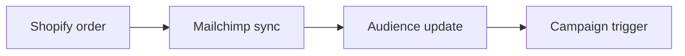

## Overview

Mailchimp helps you connect your Shopify store so customer data flows automatically. You can sync products, track purchases, and show personalized recommendations without manual updates. This guide walks you through the setup in a few clear steps.

## Shopify Integration

Follow these steps to link your store.

<Steps>
  <Step title="Sign in to Mailchimp">
    Open your Mailchimp account and go to the integrations section.

  </Step>
  <Step title="Choose Shopify">
    Select Shopify from the available ecommerce options and enter your store URL.

  </Step>
  <Step title="Authorize the connection">
    Log in to Shopify when prompted and grant access to the needed data.

  </Step>
</Steps>

<Callout kind="info">
  The connection usually completes in under five minutes. Check your store settings if you see an error.

</Callout>

## Product Recommendations

Once connected, Mailchimp can suggest products based on what customers have viewed or bought. Enable this feature in the automations panel to increase repeat purchases.

<Tabs>
  <Tab title="Basic recommendations" icon="star">
    Show products similar to items already in the cart.

  </Tab>
  <Tab title="Advanced recommendations" icon="zap">
    Include browsing history and past orders for more precise suggestions.

  </Tab>
</Tabs>

## Purchase Tracking

Mailchimp records every order so you can see revenue and segment buyers by purchase behavior.



## Examples

Here is a simple configuration snippet you can adapt.

<CodeGroup tabs="JSON,JavaScript">
```json
{
  "store": "your-store",
  "syncProducts": true,
  "trackPurchases": true
}
```
```javascript
// Example listener
mailchimp.on('purchase', function(data) {
  console.log('New order synced');
});
```

</CodeGroup>

## Best Practices

<Expandable title="Keep data fresh" default-open="false">
  Run a manual sync after large product updates so recommendations stay accurate.

</Expandable>

<Expandable title="Test before launch" default-open="false">
  Send a test campaign to yourself to confirm tracking and recommendations appear correctly.

</Expandable>

## Related Resources

<Columns cols={2}>
  <Card title="Ecommerce overview" href="https://example.com" icon="book-open">
    Learn more about connecting other stores.

  </Card>
  <Card title="Audience tools" href="https://example.com" icon="users">
    Manage segments created from purchase data.

  </Card>
</Columns>