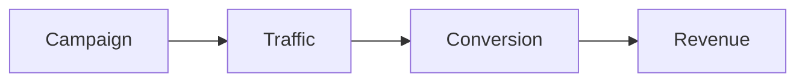

## Overview

Shopify gives you everything you need to run marketing campaigns without leaving your store. You can create discount codes, automate emails, connect ads, and track results in one place. This guide walks you through the main tools so you can start reaching customers faster.

## Create Discount Codes

Discount codes help turn browsers into buyers. You can set percentage off, fixed amounts, or free shipping.

<Card title="Quick tip" icon="zap" href="#">
  Start with a simple code like WELCOME10 to test response.
</Card>

## Set Up Email Automation

Email automation keeps customers coming back. Use built-in flows for abandoned carts, welcome series, and post-purchase messages.

<Tabs>
  <Tab title="Abandoned cart" icon="shopping-cart">
    Send a reminder 1 hour after checkout starts.

    Customers often return when they see the items again.
  </Tab>
  <Tab title="Welcome series" icon="mail">
    Send three emails over the first week.

    Introduce your brand and offer a first-order discount.
  </Tab>
</Tabs>

## Connect Ad Integrations

Link your store to Facebook, Google, and TikTok ads directly from the marketing section. Shopify syncs your product catalog so ads stay up to date.

<Callout kind="info">
  Make sure your product images meet platform size rules before launching ads.
</Callout>

## Track Conversion Analytics

See which campaigns bring sales. The analytics dashboard shows revenue, conversion rate, and top traffic sources.

## Example Campaign Flow

Follow these steps to launch your first campaign.

<Steps>
  <Step title="Create a discount">
    Go to Discounts and set a code with a 10 percent off rule.
  </Step>
  <Step title="Build an email">
    Use the automation builder to send the code to new subscribers.
  </Step>
  <Step title="Review results">
    Check analytics after three days and adjust the offer.
  </Step>
</Steps>

## Best Practices

- Test one change at a time so you know what works.
- Keep discount codes short and easy to type on mobile.
- Review analytics weekly and pause ads that do not convert.

<Expandable title="What if my campaign is not converting?" default-open="false">
  Check your audience targeting first. Narrow the group or improve the offer amount.
</Expandable>