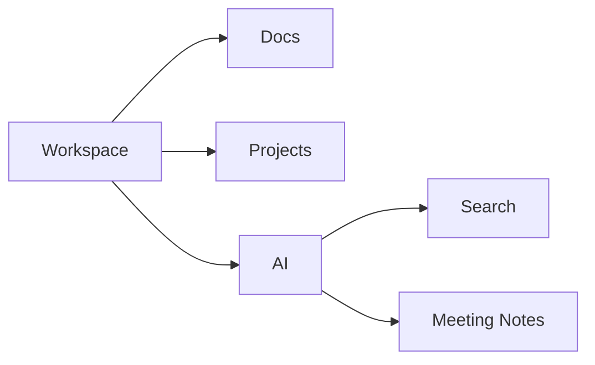

## Overview

Notion is the workspace you use for notes, docs, projects, calendar planning, and AI-assisted work. For a new hire, the goal in week one is simple: get your workspace set up, learn where your team keeps information, and use the AI features that save time on repeat tasks.

Use this guide as a day-one checklist. It focuses on the parts you will touch first: account setup, Writing Assistant, Meeting Notes, Enterprise Search, connections, projects, and calendar management.

<Callout kind="info">
Use your company workspace first. If you do not see the right pages, ask your manager or team lead before creating a duplicate system.
</Callout>

### What you will use most

- Docs for day-to-day writing and team references
- Projects for tracking work and status
- AI Meeting Notes for capturing decisions
- Enterprise Search for finding information quickly
- Connections for bringing in data from other apps
- Notion Calendar for planning time and meetings

## First-week checklist

Complete these steps in order. If your team already has a standard setup, follow that first and treat this as the fallback path.

<Steps>
  <Step title="Sign in and confirm your workspace" icon="check-circle">
    Open Notion and sign in with your work account. Confirm that you are in the correct company workspace, not a personal workspace.

    If your workspace uses team pages or a home page, bookmark it so you can return to it quickly.
  </Step>

  <Step title="Review the team home page" icon="book-open">
    Read the main onboarding page, team wiki, or department hub. Look for three things:

    - where announcements live
    - where project status is tracked
    - where standard procedures are stored

    If the page links to templates, duplicate only the ones your team expects you to use.
  </Step>

  <Step title="Set up your personal start page" icon="settings">
    Create a simple personal page for your daily links. Keep it small and practical.

    - link to your main team page
    - add your current projects
    - add your meeting notes page
    - add your task list

    This page should help you find things fast, not replace the team workspace.
  </Step>

  <Step title="Use Writing Assistant for your first draft" icon="zap">
    Draft your first intro update, status note, or meeting summary in Notion. Use Writing Assistant to tighten the wording, shorten long paragraphs, or turn rough notes into a clean draft.

    Good first uses are:

    - weekly status updates
    - onboarding questions
    - recap notes after a meeting
  </Step>

  <Step title="Capture one meeting with AI Meeting Notes" icon="mic">
    Join or create a meeting note and let Notion summarize the discussion. Check that the summary includes decisions, owners, and follow-ups.

    After the meeting, review the note and correct names, action items, or dates before you share it.
  </Step>

  <Step title="Try Enterprise Search" icon="search">
    Search for a policy, project, or team term you expect to exist. Use it to find docs instead of asking around for every detail.

    If results are vague, narrow the query with a team name, project name, or date range.
  </Step>

  <Step title="Connect the tools you use every day" icon="cloud">
    Add the external tools your team already uses through Connections. The goal is to reduce manual copying between systems.

    Ask your manager which connections are standard for your team before you add anything new.
  </Step>

  <Step title="Check your projects and calendar" icon="calendar">
    Open the active project board and confirm where your tasks appear. Then open Notion Calendar and make sure your meetings, focus blocks, and deadlines are visible.

    If your team uses due dates or status fields, confirm the naming convention before you update anything.
  </Step>
</Steps>

## Key tools

Use the cards below as your quick reference for the parts of Notion you are most likely to use in week one.

<Columns cols={3}>
  <Card title="Docs" href="#" icon="book-open">
    Write notes, specs, handoffs, and team documentation in one place.
  </Card>

  <Card title="Projects" href="#" icon="check-circle">
    Track tasks, owners, status, and deadlines without switching tools.
  </Card>

  <Card title="AI Writing Assistant" href="#" icon="zap">
    Draft, rewrite, summarize, and shorten content inside your workspace.
  </Card>

  <Card title="AI Meeting Notes" href="#" icon="mic">
    Capture meeting summaries, decisions, and next steps with less manual typing.
  </Card>

  <Card title="Enterprise Search" href="#" icon="search">
    Find answers across your workspace and connected sources faster.
  </Card>

  <Card title="Connections" href="#" icon="cloud">
    Bring external data into Notion so your team has one working surface.
  </Card>
</Columns>

### How to use each tool

| Tool | What you use it for | First thing to try |
| --- | --- | --- |
| Docs | Team notes, onboarding pages, project specs | Open the team wiki and read the main intro page |
| Projects | Task tracking and status updates | Find your current tasks and check the owner field |
| AI Writing Assistant | Drafting and editing text | Turn a rough status note into a clean update |
| AI Meeting Notes | Meeting summaries and action items | Record one meeting and review the summary |
| Enterprise Search | Finding information fast | Search for a policy or project you need this week |
| Connections | Bringing in external context | Confirm which app integrations your team already uses |

## Common workflows

These examples show how the parts fit together in day-to-day work. Use them as a starting point and then follow your team’s naming and page structure.

<Tabs>
  <Tab title="Docs" icon="book-open">
    Use Docs when you need a shared source of truth.

    - write onboarding notes
    - draft project requirements
    - collect team decisions
    - keep policies in one place

    When you create a new doc, check whether your team already has a template or folder structure.
  </Tab>

  <Tab title="Projects" icon="check-circle">
    Use Projects when work needs owners and due dates.

    - add a task with a clear owner
    - set status before you hand it off
    - update progress in the same place each day
    - link the project to the related doc

    Keep project names consistent so search works better across the workspace.
  </Tab>

  <Tab title="Calendar" icon="calendar">
    Use Notion Calendar to protect time for focus work and meetings.

    - review your week at the start of the day
    - confirm deadlines and recurring meetings
    - block time for writing or review work
    - keep meeting notes linked to the meeting itself

    If your team uses shared calendars, confirm which events should be visible to everyone.
  </Tab>
</Tabs>

<ExpandableGroup>
  <Expandable title="What if I cannot find a page?" default-open="false">
    Start with Enterprise Search. If you still cannot find it, ask your manager, team lead, or the person who owns the page structure. Do not create a duplicate page unless your team asks you to.
  </Expandable>

  <Expandable title="What should I do first if I join a meeting?" default-open="false">
    Open the meeting note, check the agenda, and capture decisions and action items. After the meeting, add missing context and assign follow-ups if your team expects that.
  </Expandable>

  <Expandable title="How do I know which project board to update?" default-open="false">
    Use the board linked from your team home page. If there are multiple boards, ask which one is the source of truth before you move any tasks.
  </Expandable>
</ExpandableGroup>

## Who to contact

If you get stuck, use the smallest escalation path that will solve the problem. Start with the page owner or your manager, then move to the team lead or workspace admin if you need access, permissions, or structure changes.

| Need | Contact first | What to ask |
| --- | --- | --- |
| Missing access | Manager or workspace admin | Ask for the page, team space, or integration you need |
| Wrong page structure | Page owner | Ask which page is the source of truth |
| AI output needs review | Team lead or content owner | Ask whether the summary or draft matches team expectations |
| Project status question | Project owner | Ask which field or status value to use |
| Calendar setup issue | Team lead or operations contact | Ask how your team schedules focus time and shared meetings |

<Callout kind="tip">
When in doubt, ask before you edit a shared page. A small clarification is faster than fixing a broken workflow later.
</Callout>

### Notes for your first week

Keep your changes small. Use Notion to learn the team’s structure, not to redesign it on day one. Once you understand where docs, projects, and notes live, you can start using AI features to save time on the repetitive parts of the work.