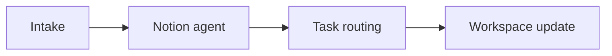

## Purpose

Use this template to document a repeatable process in Notion. It is written for internal teams that need a standard way to define work, route tasks, capture decisions, and keep related notes in one workspace.

This template fits processes that rely on Notion AI, pages, databases, and connected tools. Typical examples include agent setup, content review, project intake, and weekly reporting. Replace the placeholder details with your team’s actual names, dates, and rules.

<Columns cols={3}>
  <Card title="Agent automation" href="#">
    Define what the agent does, when it runs, and where it sends work.
  </Card>
  <Card title="Wiki and docs" href="#">
    Record the page structure, writing standards, and review steps.
  </Card>
  <Card title="Cross-tool connections" href="#">
    List the systems that sync into Notion and the handoff rules.
  </Card>
</Columns>

<Callout kind="info">
Keep the process narrow enough that one owner can review it without guessing. If the process crosses teams, name the handoff point explicitly.
</Callout>

## Steps

<Steps>
  <Step title="Define the process scope" icon="settings">
    Write a short statement that answers three questions: what starts the process, what ends it, and what the expected output is.

    Include the source page, database, or inbox that triggers the work. If an AI agent participates, note whether it creates content, classifies requests, or routes tasks.
  </Step>
  <Step title="Set the workspace structure" icon="book-open">
    Create or confirm the Notion pages and databases used by the process.

    Capture the page owner, the linked database name, and any required properties such as status, priority, assignee, or due date.
  </Step>
  <Step title="Document the routing rules" icon="arrow-right">
    Describe how work moves from intake to action.

    State the rules the agent or reviewer uses to assign items, escalate blockers, and hand off work to another team.
  </Step>
  <Step title="Add content standards" icon="code">
    Define how pages, docs, and reports should be written.

    Include naming conventions, required sections, approval criteria, and any wording that should be reused across pages.
  </Step>
  <Step title="Connect related tools" icon="cloud">
    List the external tools that sync into Notion and what data each connection provides.

    Document whether the connection is read-only, bidirectional, or used only for notifications.
  </Step>
  <Step title="Confirm continuity rules" icon="check-circle">
    State what happens when no one is available.

    Explain how the process keeps moving after hours, what the fallback owner is, and when the agent should stop and wait for review.
  </Step>
</Steps>

<ExpandableGroup>
  <Expandable title="Example intake checklist" default-open="false">
    Use this checklist when you create a new process page.

    - Confirm the process name and owner
    - List the source of incoming work
    - Record the output format
    - Define routing and escalation rules
    - Link the related wiki pages and databases
  </Expandable>
  <Expandable title="Example review questions" default-open="false">
    Use these questions during review.

    - Is the process outcome measurable?
    - Are the routing rules specific enough for an agent to follow?
    - Are the owners and fallback contacts current?
    - Do the linked pages reflect the current workspace structure?
  </Expandable>
</ExpandableGroup>

## Owners

| Role | Placeholder owner | Responsibility |
| --- | --- | --- |
| Process owner | `TBD` | Maintains the template and approves changes. |
| Agent owner | `TBD` | Configures routing, prompts, and follow-up behavior. |
| Content owner | `TBD` | Keeps docs, wiki pages, and reports current. |
| Workspace admin | `TBD` | Manages permissions and cross-tool connections. |

Use one primary owner and one backup owner for each recurring process. If the process affects multiple teams, add the team name in the responsibility column so the handoff is explicit.

<Callout kind="tip">
Review ownership whenever the workspace changes. If a page or database moves, update the owner list at the same time.
</Callout>

## Review Cadence

Review this template on a fixed schedule so the process stays current. The default cadence is monthly for active workflows and quarterly for low-change workflows. Replace the placeholders below with your team’s actual schedule.

| Item | Placeholder value | Notes |
| --- | --- | --- |
| Next review date | `TBD` | Use a date your team can maintain. |
| Review owner | `TBD` | The person who collects updates. |
| Backup reviewer | `TBD` | Covers absences and vacations. |
| Change source | `TBD` | Examples: agent behavior, page structure, or tool connections. |

For each review, check whether the process still matches the work, whether routing still makes sense, and whether the wiki pages are still the right source of truth. If the process depends on continuous updates, verify that the agent or reviewer can keep work moving outside business hours.

<Update label="TBD" description="Template review" tags={["improvement"]}>

## Recent changes

- Confirmed the process sections required for recurring workflows.
- Added placeholders for owners, dates, and review notes.
- Kept the structure limited to purpose, steps, owners, and cadence.

</Update>