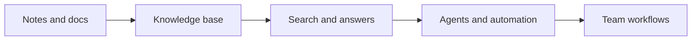

## Welcome

Welcome to the Notion Knowledge Base. Use this space to learn how the workspace brings notes, docs, projects, and agents into one place.

This landing page points you to the main areas teams use most: the platform overview, AI automation, knowledge management, and collaboration workflows.

<Callout kind="tip">

You can restrict access to this knowledge base so only your team can view it. If you need a broader or narrower audience, confirm the sharing settings before you publish links.

</Callout>

## Start here

Use the links below to jump into the most common topics.

<Columns cols={3}>
  <Card title="Platform overview" href="#" icon="book-open">
    Learn how Notion organizes workspace content, apps, and connected tools in one place.
  </Card>

  <Card title="AI agents and automation" href="#" icon="zap">
    See how agents handle repetitive work, answer questions, and help route tasks.
  </Card>

  <Card title="Knowledge base and wikis" href="#" icon="database">
    Understand how to centralize team knowledge in pages, databases, and shared spaces.
  </Card>
</Columns>

## What this workspace covers

Notion combines several workspace surfaces in a single system. Notes and docs help you capture and structure information, projects help you track work, and AI features help you automate routine tasks.

### Platform overview

The core platform gives you a shared workspace for writing, planning, and organizing. You can use it to keep documentation, project status, and internal references in one environment instead of splitting them across separate tools.

### AI agents and automation

Notion AI includes agents that can automate busywork, draft content, answer questions, and route work. Use them when a repeated task follows a clear pattern, such as summarizing notes or generating a status update from a project page.

### Knowledge base and wikis

A knowledge base in Notion usually starts with a wiki structure. You create pages for policies, guides, and reference material, then connect them so people can find the right information without searching across multiple systems.

### Team collaboration workflows

Teams use shared pages, comments, mentions, and project databases to work together. The goal is to keep decisions, work status, and supporting notes in the same place so updates stay visible.

## Common entry points

These sections map to the areas most teams use first.

| Area | What it is for | Typical use |
| --- | --- | --- |
| Notion AI | AI tools for work | Drafting, summarizing, and answering questions |
| Agents | Automating busywork | Repetitive actions and routed tasks |
| Meeting Notes | Capturing discussions | Turning meetings into written summaries |
| Enterprise Search | Finding answers fast | Locating information across the workspace |
| Docs | Structured documentation | Policies, guides, and team references |
| Projects | Tracking delivery work | Plans, milestones, and status updates |

## How the main pieces fit together

## Suggested first read

<Steps>
  <Step title="Learn the platform" icon="book-open">
    Start with the platform overview so you understand how pages, databases, and connected apps fit together.

  </Step>

  <Step title="Review AI features" icon="zap">
    Read the AI section next to see where agents, meeting notes, and enterprise search fit into daily work.

  </Step>

  <Step title="Set up team knowledge" icon="database">
    Use the wiki and docs guidance to define where your team stores policies, project context, and reference material.

  </Step>

  <Step title="Adopt collaboration workflows" icon="users">
    Confirm how your team uses comments, task tracking, and shared pages so work stays visible and easy to hand off.

  </Step>
</Steps>

## Need a deeper dive?

If you are looking for a specific workflow, start with the most relevant area and follow the linked pages from there. Keep pages short, name them clearly, and make sure ownership is obvious so people know where to update content.